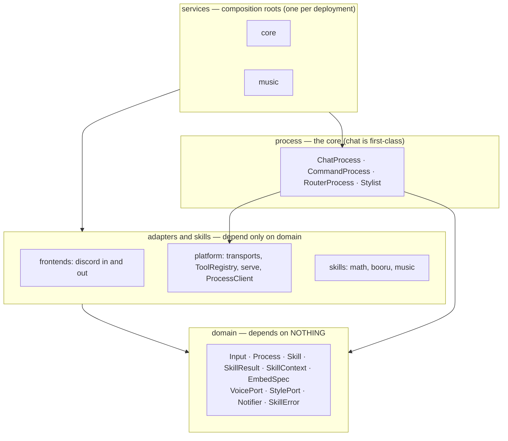
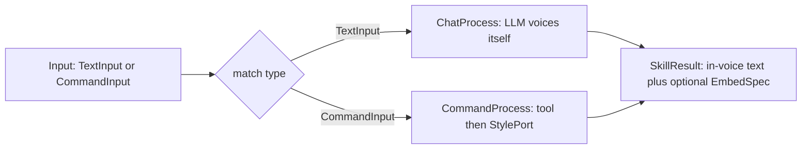

# ADR 0009: The process pipeline — input → process → output

- Status: Accepted
- Date: 2026-06-22
- Resolves the *Open issue* of [ADR 0008](0008-llm-native-persona-styling.md);
  reshapes the vocabulary/internals of [ADR 0006](0006-gateway-edge-microservice-skills.md).

## Context

PetBot is a chatbot: **`input → process → output`**. That loop is the domain;
everything else should be a Port or a frozen pydantic model. The shipped code did not
hold that line. ADR 0008's *Open issue* named the core smell: presentation leaked into
the domain (a `style_results` flag on `SkillContext`, a styling transform inside the
generic dispatcher), the request path was >8 hops with two arg-validations and three
parallel skill-lists, the `Worker` was a god-object, **chat was modelled as a peer
skill** of math/booru rather than the orchestrating process, the source tree was
organised by *deployment unit* (`workers/core`, `workers/music`), errors had two
paradigms (returned failures vs. exceptions), and there was no outbound port for
long-running output.

## Decision

A minimal `input → process → output` pipeline where the **process is first-class and
chat is it**, skills are the *tools* a process calls, presentation lives at the output
boundary, and the source is organised **by concept** while deployment is organised **by
service**. The locked decisions:

1. **Domain = the loop.** `domain/` is models (frozen pydantic) + ports (Protocols) +
   a `SkillError` hierarchy — nothing else.
2. **`Process` is the verb**, DI'd: `ChatProcess` (the LLM brain, for `@mention`),
   `CommandProcess` (for slash). They live in `petbot.process` — **chat is not a skill.**
3. **`Input` is a discriminated sum type** `TextInput | CommandInput` — illegal states
   unrepresentable, no bag-of-optionals.
4. **One typed catalog.** `Command[ArgsT]` (+ `CATALOG`) replaces the `Skills` protocol,
   the `SkillsClient`, and the `COMMANDS`/`command_handler` pipeline. Typing rides the
   generic; the slash surface and the agent's tools both derive from it.
5. **No flag/string/boolean branching in the core.** Every variation is a DI choice.
   The *one* surviving conditional is an exhaustive `match` on the `Input` sum type
   (`RouterProcess`) — compiler-checked, the type-safe dispatch.
6. **Styling is a uniform output `StylePort`**, DI'd per process: a `Stylist` (a small
   LLM) for the command path, a no-op `PassthroughStyle` for chat (the agent already
   voices itself). Embeds are never restyled; the persona model stays compute-side.
7. **Errors are raised, not returned.** A skill raises a `SkillError`; it propagates to
   the process output boundary, which catches it **once**, voices the message through
   the same `StylePort`, and returns a `SkillResult`. There is no error channel on the
   result. The only frontend-side error is a transport failure (the styler is
   unreachable) → a static fallback.
8. **Stateful skills use dependency inversion.** A live `VoicePort` is resolved
   compute-side per `conversation_id` from an injected `VoiceProvider`, gated by
   `Skill.requires`; the skill returns a plain ack, never the port.
9. **`Worker` dissolves.** Its jobs split into a `ToolRegistry` (the tools a process
   calls), the `Process` impls (dispatch), and a `serve` boundary (the wire). The
   transport seam (`HttpTransport`/`LambdaTransport`) is the only frontend↔compute
   coupling; the in-process `LocalTransport` is gone — the chat agent calls its tools
   straight through the `ToolRegistry`.
10. **`Notifier`** is a new outbound port, symmetric to the inbound dispatch, for
    long-running / async output (a music queue advancing, future streaming). The
    synchronous pipeline never becomes a stream; later output rides this port.

### Two roles, organised by concept

There are exactly two conceptual roles: the **frontend** (the driver — holds the
gateway, maps events to `Input`, renders) and the **compute service** (the completioner
— runs the process behind a transport). "core" and "music" are *deployments* of the
compute role, not source packages. The transport is their only coupling.



Source layout:

```
src/petbot/
  domain/      kernel: models + ports + SkillError
  process/     the core: ChatProcess · CommandProcess · RouterProcess · voice(Stylist)
  skills/      tools: math · booru · music
  frontends/   the driver: discord
  platform/    plumbing: ToolRegistry · serve · ProcessClient · transports · Dispatch
  types/       args + CATALOG (Command[ArgsT])
deploy/  +  petbot.services.{core,music}   # composition roots, by service
```

### The pipeline



The frontend builds an `Input` and calls `ProcessClient.respond` over a transport; the
compute side's `serve` decodes a `Dispatch`, the `RouterProcess` routes by input type,
and the process runs its tools through the `ToolRegistry`. An expected failure raised by
a tool is caught at the process output boundary and voiced; the frontend renders the
result generically. Full end-to-end sequences (mention, slash, music) and the
dependency contracts are in [`docs/architecture.md`](../architecture.md) and
[`AGENTS.md`](../../AGENTS.md).

## Consequences

- The domain context and the generic dispatcher no longer carry or interpret a styling
  flag; presentation lives where presentation belongs.
- Adding a skill is fewer edits (one `*Args` + one `CATALOG` entry + the package), and
  the codebase **shrank** (~450 source/test lines net).
- The compute role is generic: `core` vs `music` differ only by installed extras,
  transport, and injected providers — not by source organisation. Relocating or
  splitting a service is a provisioning change, not a rewrite.
- The capability **exposure filter** (`requires ⊆ provides`) and the `Notifier`
  consumer are deliberately **deferred** — the seams exist; the machinery lands when a
  real consumer does (a second frontend; the music async tail).

## Relationship to prior ADRs

- **Resolves** ADR 0008's *Open issue* (presentation/domain entanglement).
- **Reshapes** ADR 0006's vocabulary and internals (edge→frontend, worker→compute
  service, `Worker`→`ToolRegistry`+`Process`+`serve`, bundles→`petbot.services.*`); its
  decisions (one Gateway ingress, microservice compute, music as its own service) stand.
- **Keeps** ADR 0003 (neutral core, sharpened into the `domain` kernel), ADR 0007 (the
  pydantic-ai agent — now the `ChatProcess`), and ADR 0005 (the core service's Lambda
  path).
