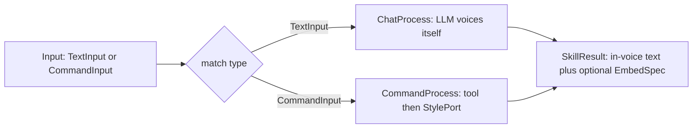
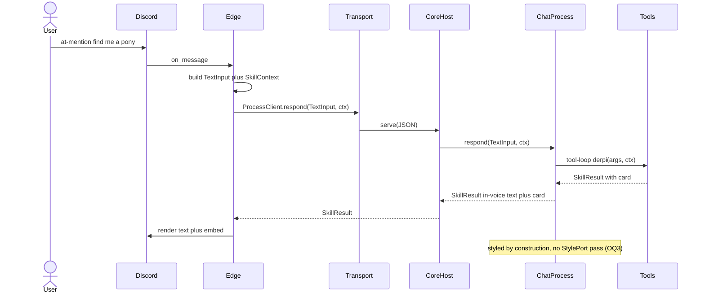
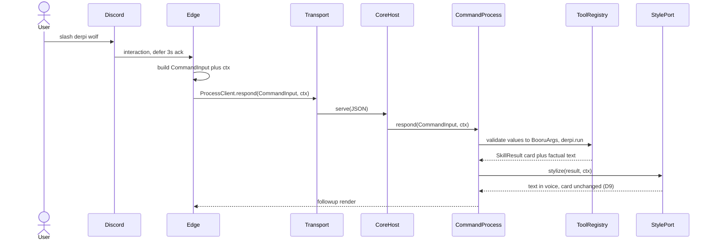
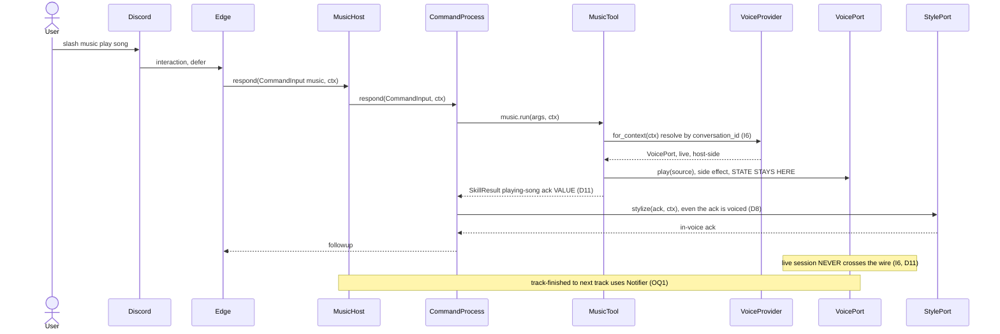
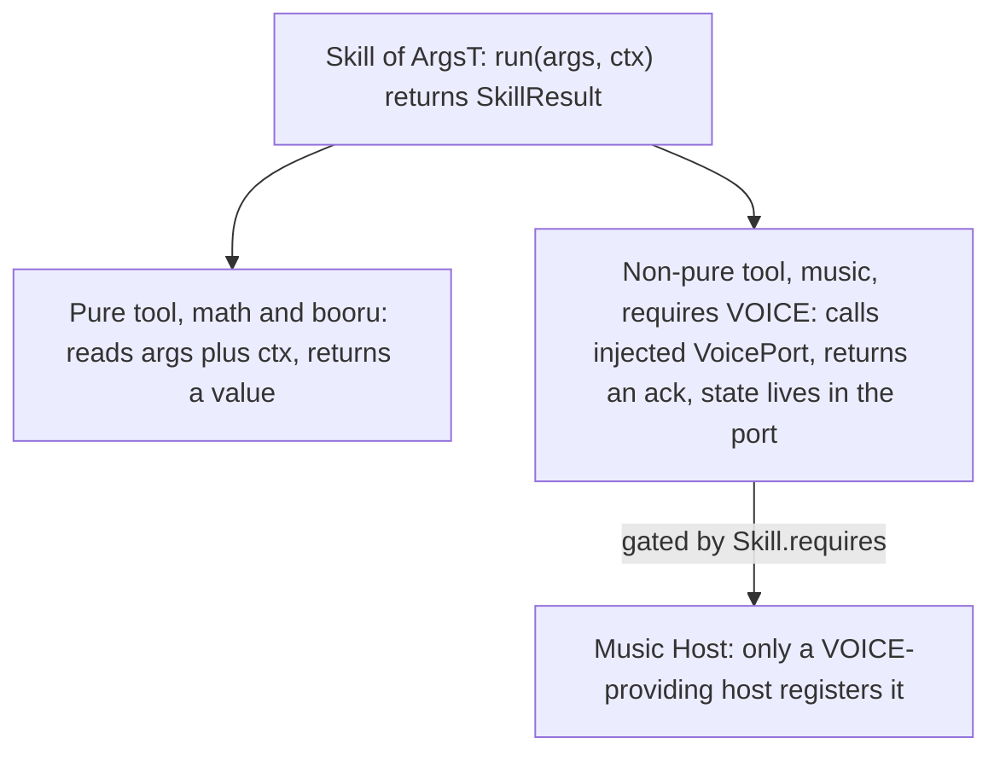

# Process-Pipeline Reframe — working design doc

Living record for the DDD/DI realignment. **Not impl.** Supersedes the "Open issue"
section of [ADR 0008](../adr/0008-llm-native-persona-styling.md); becomes a real ADR
once signed off. Decisions are **locked unless reopened** — read this before proposing
anything.

One-line frame: **PetBot is a chatbot. The domain is `input → process → output`.
Everything else is a Port or a frozen pydantic model.**

Acceptance smell-test for the whole exercise: **the refactor must SHRINK the codebase.**
Any change that nets more lines/functions is suspect (see *Shrink ledger*).

---

## Decisions (locked)

| # | Decision |
|---|---|
| D1 | Domain = the loop `input → process → output`. Everything else is a **Port** or a **frozen pydantic class**. |
| D2 | **`Process` is the pipeline verb.** Chat is *the* headline process. Impls are **DI'd**: `ChatProcess` (@mention), `CommandProcess` (slash). Edge stays a minimal dispatcher. |
| D3 | The pipeline is **minimal** (~5 hops). Swap the DI'd impl; never add steps. |
| D4 | **`Input` is a discriminated sum type** — `TextInput \| CommandInput`. No bag-of-optionals; illegal states unrepresentable. |
| D5 | **Static typing preserved end-to-end.** No stringly-typed dispatch. |
| D6 | **One typed catalog.** `Skills` protocol, `SkillsClient`, and `COMMANDS` collapse into a single generic `Command[ArgsT]` list. Hand-written per-skill methods deleted; typing rides the generic. |
| D7 | **`style_results` removed from `SkillContext`.** |
| D8 | **All output text is in PetBot's voice — universally.** @mention styled *by construction* (agent voices itself); slash styled by the **`StylePort`**. No per-command opt-out. |
| D9 | **Embeds are never restyled.** Style rewrites *text* only; the card passes through. Error results pass through. |
| D10 | Persona/**Style** model stays host-side, never on the wire. Nomenclature is **Style** (`StylePort`/`StyleProvider`). |
| D11 | **Stateful skills use dependency inversion.** A live session lives behind an **injected** port (`VoicePort`) resolved host-side per `conversation_id`, gated by `Skill.requires`. The skill is *handed* the port; never returns/serialises it. Output is a plain value. |
| D12 | **Music is the scaffolded exemplar** of a non-pure skill — seam built end-to-end, audio impl not. |
| D13 | **"Worker" the god-object dissolves** → `ToolRegistry` + `CommandProcess` + a `serve` boundary + a `Host`. |
| D14 | **Transport seam stays** (`local`/`http`/`lambda`) — orthogonal deploy axis. Music is a forced-separate host. |
| D15 | **`SkillCall` + `Transport` move out of `domain`** into `platform`. |
| D16 | **`StyleProvider.for_context` gating disappears.** Slash always styles; @mention never uses the port. `CommandProcess` just holds a `StylePort`. |

## Invariants (binding)

I1 `domain` imports nothing first-party, no `discord`/`httpx`. ·
I2 the edge never imports a skill. ·
I3 skills pure w.r.t. platform (read args+ctx, return `SkillResult`, branch on ctx not platform). ·
I4 `SkillContext` is pure serialisable data — no live ports. ·
I5 explicit gated on `ctx.allows_explicit`. ·
I6 live ports resolved host-side per `conversation_id`, never serialised. ·
I7 logging configured once per entrypoint. ·
I8 tests + docs per behaviour change.

## Open questions

| # | Question | Proposed answer (pending sign-off) |
|---|---|---|
| OQ1 | **Async / long-running tail.** A track finishing wants to push "now playing next" *after* the ack; future long jobs (renders, scheduled tasks) emit output over time. The synchronous `input→process→output` can't express "keep emitting". | **Add one outbound port, `Notifier`, symmetric to input.** The core stays synchronous request→ack. Anything long-running lives behind a port that, when it has more to say, calls `Notifier.deliver(conversation_id, SkillResult)` — the edge implements it (it already knows how to render to a channel). No async leaks into the domain pipeline; the gap closes with *one* port, not a redesign. See *The async gap*. |
| OQ2 | **Names.** Keep `Skill` for tools, or rename `Tool`? | **Keep `Skill`.** The sprawl was `Skills`/`SkillsClient`/`SkillCall`/`CommandSpec` — all deleted/renamed below. After that, `Skill`/`SkillContext`/`SkillResult` is coherent. |
| OQ3 | **`ChatProcess` + Style.** | Agent prose is styled by construction → **no second `StylePort` pass**. Tool-call embeds pass through untouched. |

---

## Name alignment (current → new)

| Current | New | Role / fate |
|---|---|---|
| `Skill[ArgsT]` | `Skill[ArgsT]` *(keep)* | a tool a process calls — pure or port-driving |
| `Skills` (Protocol) | **deleted** | redundant typed facade |
| `SkillsClient` | `ProcessClient` *(reshaped)* | edge's handle to the `Process` port over a transport — **one** method, not five |
| `SkillCall` | `Dispatch` *(moved to `platform`)* | wire envelope (target + `Input` + ctx) |
| `SkillContext` | `SkillContext` *(keep, loses `style_results`)* | request facts |
| `SkillResult`, `EmbedSpec` | *(keep)* | output value / neutral card |
| `CommandSpec[ArgsT]` + `_command` + `COMMANDS` | `Command[ArgsT]` + `CATALOG` | the single typed list — `(name, description, args_model)`, **no `invoke` lambda** |
| `command_handler` / `dispatch_command` (`pipeline.py`) | **deleted** | replaced by a 3-line `match` in the host + a generic edge loop |
| `Worker` | **dissolved** | → `ToolRegistry` (catalog) + `CommandProcess` (dispatch) + `serve` (boundary) + `Host` (composition) |
| `Worker.run` | `CommandProcess.respond` | name → tool → result |
| `Worker._styled` | **deleted** | folded into `CommandProcess` + `StylePort` |
| `Transport`, `Local/Http/LambdaTransport` | *(keep, in `platform`)* | deploy axis |
| `ChatSkill` | `ChatProcess` | @mention impl |
| — (new) | `CommandProcess` | slash impl |
| `Stylist` | `Stylist` *(keep — a `StylePort`)* | text style transfer |
| `LLMStyleProvider` | **deleted** (D16) | no gating needed |
| `VoicePort` / `VoiceProvider` | *(keep)* | stateful voice session port |
| — (new) | `Process` (Protocol) | the verb |
| — (new) | `Input = TextInput \| CommandInput` | sum-type input |
| — (new) | `Notifier` (Protocol) | outbound port for async/long-running (OQ1) |

**Net: this table deletes more than it adds.**

---

## The async gap (OQ1, expanded)

PetBot's core is **request → response**: one `Input` in, one `SkillResult` out,
synchronously. Music-voice and future long-running work are **not** request-response —
they run on after the reply and emit output later. The synchronous `Process` port can't
say "keep emitting".

The gap is **not** "we need async in the domain". It is: **PetBot has an inbound port
(events in) but no outbound port (events out).** Add the symmetric one:

```
Inbound  : Discord event → Input → Process            (exists)
Outbound : something has more to say → Notifier.deliver(conversation_id, SkillResult)   (new)
```

- The domain pipeline stays purely synchronous; nothing in it becomes a stream.
- A long-running effect (music queue, a render job, a reminder) lives **behind a port**
  (D11). When it produces output, it calls `Notifier`, which the **edge** implements —
  the edge already knows how to render a `SkillResult` to a channel.
- One port covers music's "next track", the future LLM-streaming case, scheduled tasks.

So "long-running" never touches `input→process→output`; it's absorbed by the port that
owns the work, talking back through `Notifier`. This is the only structural addition the
future needs, and it's a *port*, not a pipeline change.

---

## Calling patterns (proof it shrinks, not grows)

**Edge @mention — today** (needs `Skills` proto + `SkillsClient.chat` + transport):
```python
async def _chat(self, text, message):
    return await self.skills.chat(ChatArgs(message=text), build_context(message))
```
**after** (`ProcessClient` has ONE method; no `ChatArgs`, no per-skill proto):
```python
out = await self._process.respond(TextInput(text=text), build_context(message))
```

**Edge slash — today**: loop `COMMANDS`, wrap each in the `command_handler` HOF →
`dispatch_command` → `spec.invoke` lambda → `skills.X`. **after**: same loop, handler
body inlined to 3 lines, no HOF, no `invoke` lambda:
```python
async def handle(interaction, **values):
    await interaction.response.defer()
    ctx = build_interaction_context(interaction)
    out = await process.respond(CommandInput(name=spec.name, values=values), ctx)
    await respond_interaction(interaction, out)
```

**Host dispatch — replaces all of `Worker.run`/`serve`/`_styled`**:
```python
async def respond(self, inp: Input, ctx: SkillContext) -> SkillResult:
    match inp:
        case TextInput():    return await self._chat.respond(inp, ctx)
        case CommandInput(): return await self._command.respond(inp, ctx)
```

**Adding a skill — today: 5 edits** (`args.py`, `Skills` proto, `SkillsClient`,
`COMMANDS` entry+lambda, package+entry-point). **after: 3** (`args.py`, one `CATALOG`
entry `Command("name", "desc", NameArgs)`, package+entry-point).

### Shrink ledger (estimate)

| Out | ~lines | In | ~lines |
|---|---|---|---|
| `Skills` protocol | 31 | `domain/process.py` (`Input`+`Process`) | 30 |
| `SkillsClient` | 42 | `CommandProcess` | 18 |
| `command_handler`/`dispatch_command` | 45 | `ChatProcess` (mostly moved `ChatSkill`) | 12 |
| `CommandSpec.invoke` + `_command` | 25 | host `match` router | 5 |
| `Worker._styled` + style_provider plumbing | 25 | `Notifier` port | 8 |
| `LLMStyleProvider` | 15 | | |
| **≈ 183 out** | | **≈ 73 in** | |

**Net ≈ −110 lines** and fewer indirections. (Estimate — confirm against the real diff.)

---

## Diagrams

### 1 — Layering: a 3-ring onion, not a mesh

Rule: ring 1 depends **only** on `domain`; ring-1 siblings never import each other
(edge never imports a skill, I2). Hosts are the *only* place imports converge.

```mermaid
graph TD
    subgraph R2["hosts — composition roots (wire everything)"]
        core["core host"]
        music["music host"]
        edgerun["edge runner"]
    end
    subgraph R1["adapters and skills — depend ONLY on domain"]
        edge["edge: Discord in and out"]
        trans["transports: local http lambda"]
        skills["skills: math booru chat-agent music"]
        style["Stylist: StylePort"]
        voice["voice: VoicePort"]
    end
    subgraph R0["domain — depends on NOTHING"]
        d["Input · Process · Skill · SkillResult · SkillContext · EmbedSpec<br/>VoicePort · StylePort · Notifier"]
    end
    R1 --> R0
    R2 --> R1
    R2 --> R0
```

### 2 — Domain pipeline: routing is the `Input` *type*, not a flag



### 3 — @mention end-to-end (edge perspective)



### 4 — slash /derpi end-to-end (StylePort path)



### 5 — /music: non-pure exemplar, state stays behind the port



### 6 — Pure vs non-pure tool, one contract


