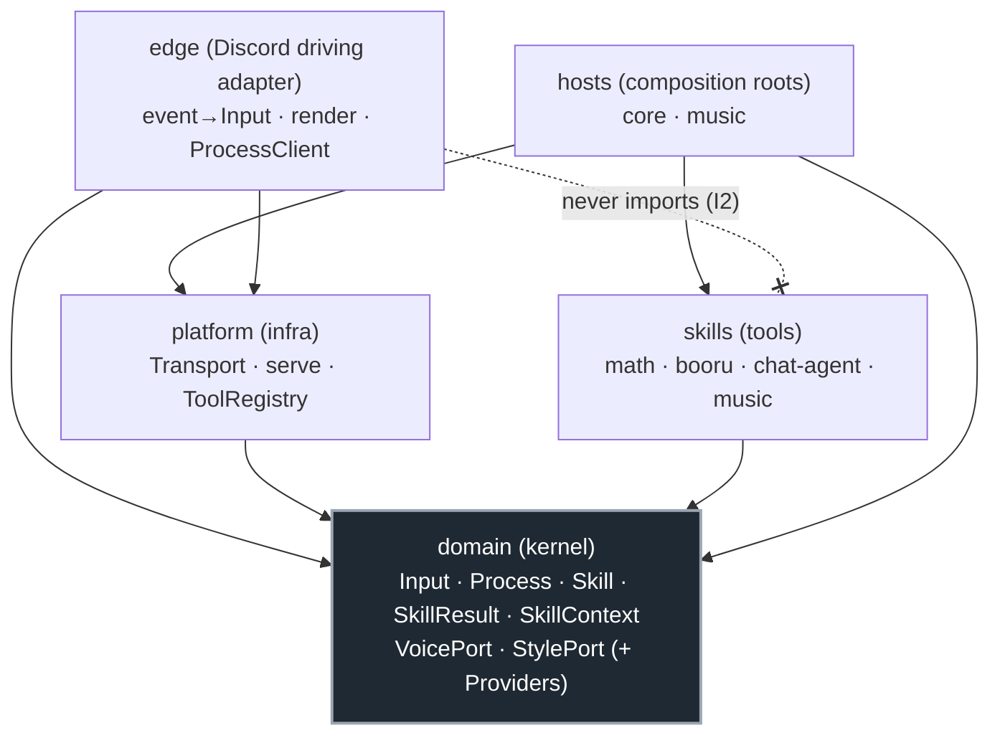
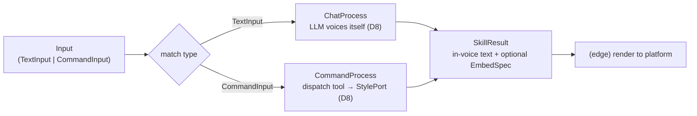
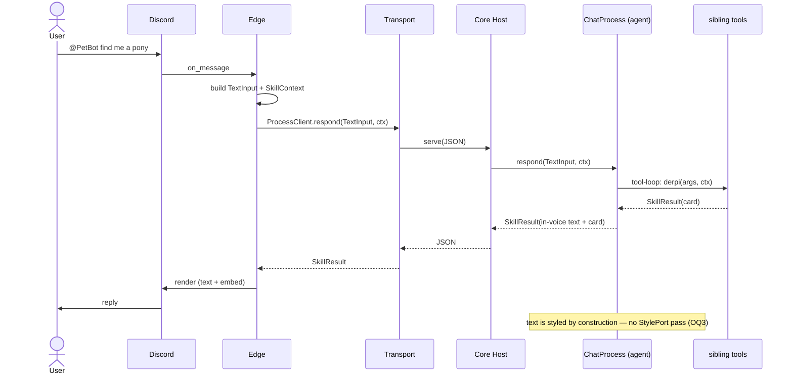
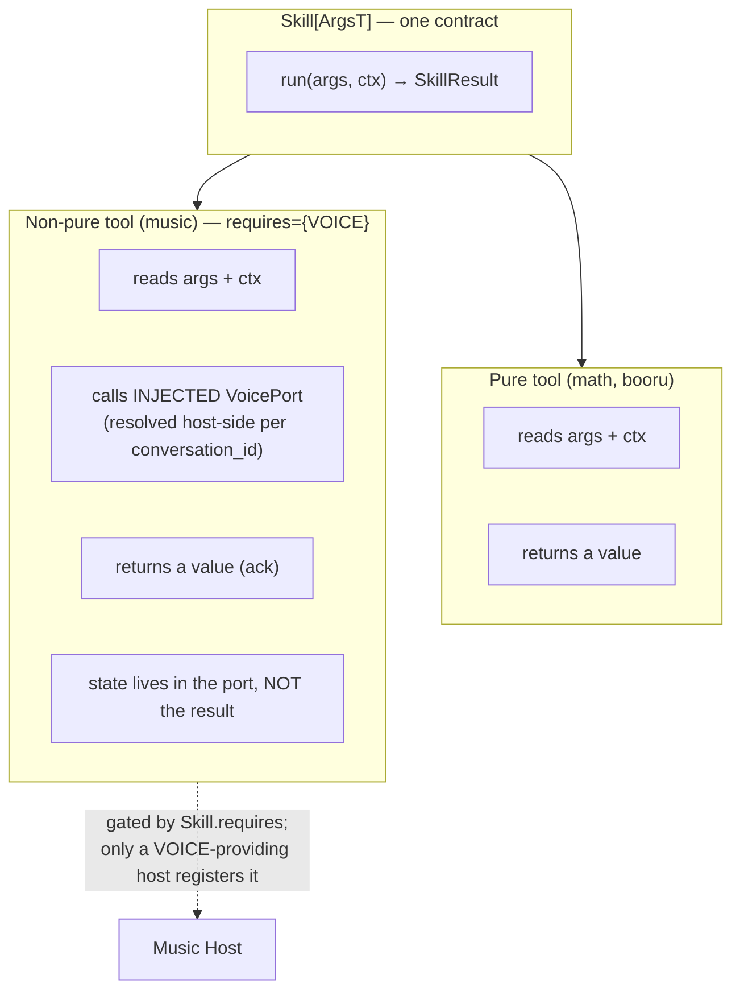

# Process-Pipeline Reframe — working design doc

Living record for the DDD/DI realignment. **Not impl.** Supersedes the "Open issue"
section of [ADR 0008](../adr/0008-llm-native-persona-styling.md); becomes a real ADR
once the maintainer signs off. Decisions below are **locked unless the maintainer
reopens them** — read this before proposing anything, so we never re-derive a settled
point.

The one-line frame: **PetBot is a chatbot. The domain is `input → process → output`.
Everything else is a Port or a frozen pydantic model.**

---

## Decisions (locked)

| # | Decision | Source |
|---|---|---|
| D1 | Domain = the chatbot loop `input → process → output`. Everything else is a **Port** or a **frozen pydantic data class** — no exceptions. | maintainer |
| D2 | **`Process` is the first-class pipeline verb.** Chat is *the* headline process. Implementations are **DI'd**, not branched-in-code: `ChatProcess` (@mention), `CommandProcess` (slash). | maintainer |
| D3 | The pipeline is **minimal** (~5 hops), not >8. We swap the DI'd impl, we do **not** add steps. | maintainer |
| D4 | **`Input` is a discriminated (sum) type** — `TextInput \| CommandInput`. Never a bag-of-optionals. Illegal states unrepresentable. | maintainer |
| D5 | **Static typing is preserved end-to-end.** No stringly-typed dispatch. A refactor that erases typing is wrong. | maintainer |
| D6 | **One typed catalog.** The three parallel skill-lists (`Skills` protocol, `SkillsClient`, `COMMANDS`) collapse into a single generic `CommandSpec[ArgsT]` source; the hand-written per-skill methods are deleted. Typing rides the generic, not the duplication. | maintainer |
| D7 | **`style_results` removed from `SkillContext`.** Styling is neither a domain-context flag nor a generic-dispatcher concern. | maintainer (ADR 0008 smell) |
| D8 | **All output text is in PetBot's voice — universally.** @mention is styled *by construction* (the chat agent voices itself); slash is styled by the **`StylePort`**. There is **no per-command opt-out** ("voiced" flag is dead). | maintainer |
| D9 | **Rich embeds are never restyled.** Style transfer rewrites *text* only; the `EmbedSpec` card passes through untouched. Error results pass through unchanged. | maintainer + existing `Stylist` |
| D10 | The **persona/Style model stays host-side**, never crosses the wire (ADR 0006 inv. 4, ADR 0008). Nomenclature is **Style** (`StylePort`/`StyleProvider`), not "voiced"/"stylize-flag". | maintainer |
| D11 | **Stateful skills fit by dependency inversion.** A live session (voice socket + queue) lives behind an **injected Port** (`VoicePort`) resolved host-side per `conversation_id`, gated by `Skill.requires` capability. The skill is *handed* the port; it never *returns* or serialises it. Output stays a plain value (an ack). | maintainer + existing `VoiceProvider` |
| D12 | **Music is the scaffolded exemplar** of a non-pure skill. We build the seam end-to-end (host, `VoiceProvider`, `VoicePort`, ack) but **not** the full audio implementation. | maintainer |
| D13 | **"Worker" the god-object is dissolved.** Its four jobs split: tool registry (`ToolRegistry`), dispatch (`CommandProcess`), wire boundary (`serve` adapter), composition (a **Host**). "Worker" stops being a noun. | maintainer |
| D14 | **The transport seam stays** (`local`/`http`/`lambda`) — an orthogonal *deploy* axis. Music is a **forced-separate host** (gateway + UDP). | ADR 0006 |
| D15 | **`SkillCall` + `Transport` leave `domain`** for `platform` — they are dispatch infra ("routing, not request-facts"), not domain. | ADR 0008 |
| D16 | **`StyleProvider.for_context` gating disappears.** Since slash is *always* styled (D8) and @mention *never* uses the port, there is nothing to gate: `CommandProcess` is simply constructed with a `StylePort` and always applies it. | follows from D8 |

## Invariants (carried, still binding)

| # | Invariant |
|---|---|
| I1 | `domain` imports nothing first-party, and no `discord`/`httpx`. |
| I2 | The edge never imports a skill; it carries no skill dependencies. |
| I3 | Skills are pure w.r.t. the platform: read `args` + `ctx`, return a `SkillResult`, branch on `ctx` flags — never on the platform name. |
| I4 | `SkillContext` is pure serialisable data — no live ports on it. |
| I5 | Explicit content is gated on `ctx.allows_explicit`. |
| I6 | Live ports are resolved host-side per `conversation_id` and never serialised. |
| I7 | Logging is configured once per entrypoint. |
| I8 | Tests + docs accompany every behaviour change; external APIs mocked, LLM via `TestModel`. |

## Open questions (NOT yet decided)

| # | Question |
|---|---|
| OQ1 | **Music async follow-up.** A track finishing on its own wants to post "now playing next" — output that arrives *after* the sync ack. Model it now as a notification port back to the frontend, or scope v1 to the sync ack and defer? (The one place the pure `input→process→output` shape has a real seam.) |
| OQ2 | **Final vocabulary.** Confirm `Process` / `Tool` / `Input` / `Host`. In particular: do tools keep the name **`Skill`**, or rename to **`Tool`** (they are what a `Process` calls)? |
| OQ3 | **`ChatProcess` + Style.** Confirmed lean: the agent's prose is styled *by construction*, so it does **not** also pass through `StylePort` (no double pass). Embeds from its tool-calls still pass through untouched (D9). Confirm. |

---

## Diagrams

### 1 — Layered dependencies (everything points *into* `domain`; `domain` points nowhere)



### 2 — The domain pipeline (the one verb; routing is the `Input` *type*, not a flag)



### 3 — @mention, end-to-end (edge perspective)



### 4 — slash `/derpi`, end-to-end (the StylePort path)

```mermaid
sequenceDiagram
    actor U as User
    participant D as Discord
    participant E as Edge
    participant T as Transport
    participant H as Core Host
    participant MP as CommandProcess
    participant Reg as ToolRegistry
    participant S as StylePort (small LLM)

    U->>D: /derpi wolf
    D->>E: interaction (defer 3s ack)
    E->>E: build CommandInput("derpi", values) + ctx
    E->>T: ProcessClient.respond(CommandInput, ctx)
    T->>H: serve(JSON)
    H->>MP: respond(CommandInput, ctx)
    MP->>Reg: validate values → BooruArgs; derpi.run(args, ctx)
    Reg-->>MP: SkillResult(card + factual text)
    MP->>S: stylize(result, ctx)
    S-->>MP: SkillResult(text in PetBot voice; card unchanged D9)
    MP-->>H: SkillResult
    H-->>T: JSON
    T-->>E: SkillResult
    E->>D: followup render
```

### 5 — `/music` (non-pure exemplar): stateful session stays behind the port

```mermaid
sequenceDiagram
    actor U as User
    participant D as Discord
    participant E as Edge
    participant T as Transport
    participant MH as Music Host<br/>(holds gateway + UDP)
    participant MP as CommandProcess
    participant Tool as music tool
    participant VP as VoiceProvider
    participant Port as VoicePort<br/>(live session)
    participant S as StylePort

    U->>D: /music play song
    D->>E: interaction (defer)
    E->>E: build CommandInput("music", {play, song}) + ctx
    E->>T: ProcessClient.respond(...)  [transport routes to music host]
    T->>MH: serve(JSON)
    MH->>MP: respond(CommandInput, ctx)
    MP->>Tool: music.run(args, ctx)
    Tool->>VP: for_context(ctx)  — resolve by conversation_id (I6)
    VP-->>Tool: VoicePort (live, host-side)
    Tool->>Port: play(source)  — side effect; STATE STAYS HERE
    Tool-->>MP: SkillResult("playing song")  — plain ack VALUE (D11)
    MP->>S: stylize(ack, ctx)  — even the ack is voiced (D8)
    S-->>MP: SkillResult(in-voice ack)
    MP-->>MH: SkillResult
    MH-->>T: JSON
    T-->>E: SkillResult
    E->>D: followup
    Note over Port: the live session NEVER crosses the wire (I6, D11)
    Note over MH,Port: "track finished → play next" = OQ1 (async follow-up, undecided)
```

### 6 — Pure vs non-pure tool, one contract


